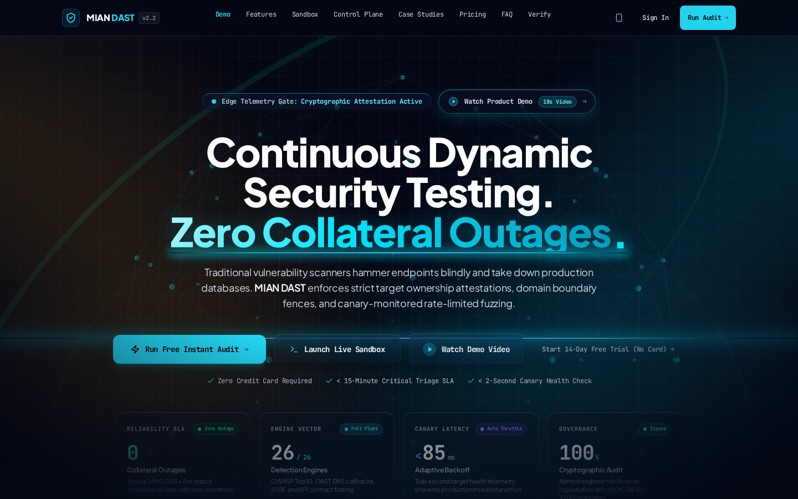
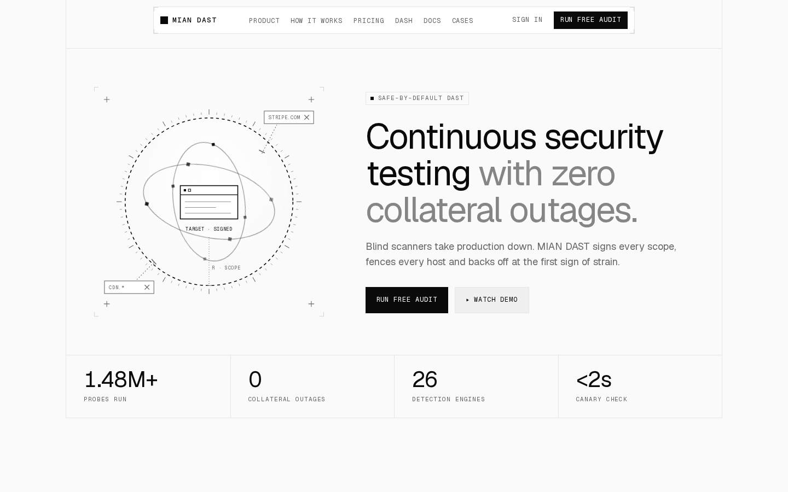
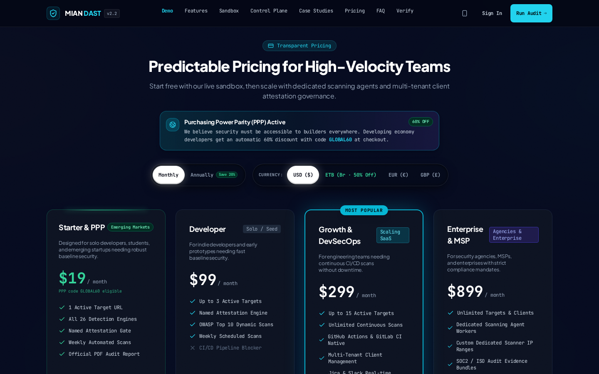
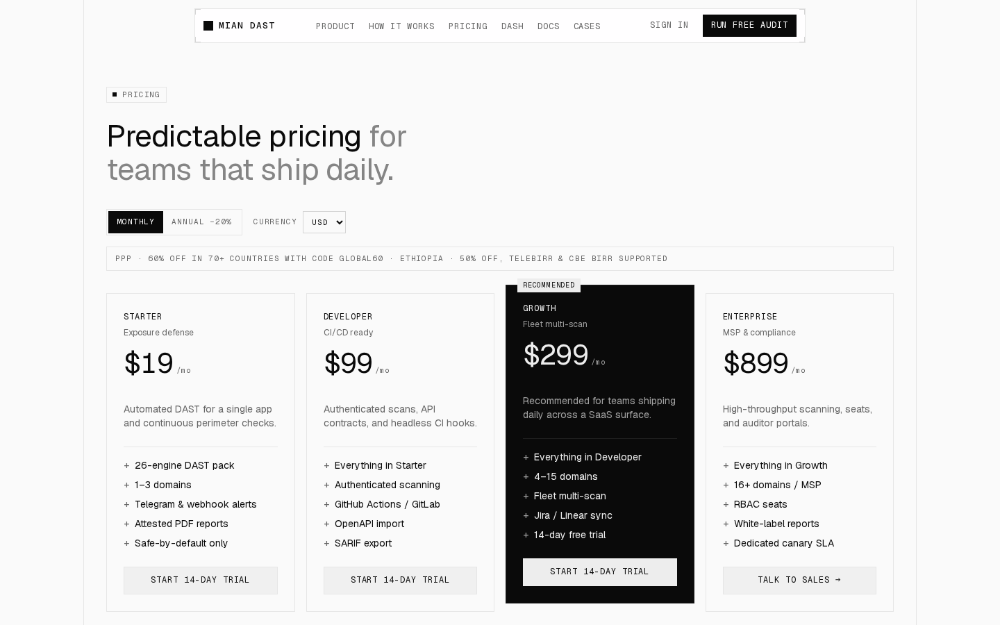
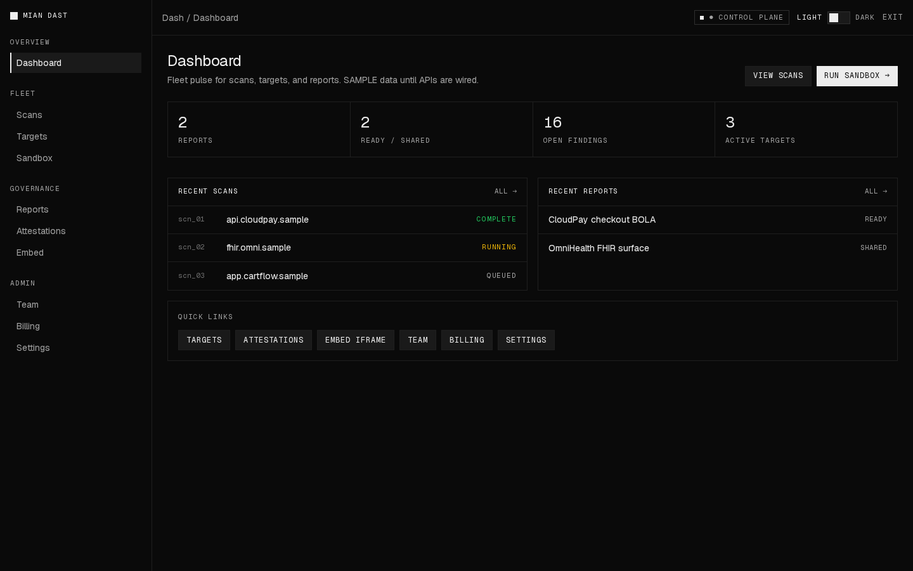

# MIAN DAST

UI skeleton for **MIAN DAST** — safe-by-default dynamic application security testing. Redesigned from the live product site into an instrument-grade, open-source front end with a control-plane dash for reports and fleet admin.

**License:** [MIT](LICENSE)  
**Design:** [Yaltopia Tech](https://www.yaltopiatech.com/) · [LinkedIn](https://www.linkedin.com/company/yaltopiatech)  
**Design source of truth:** [`docs/ui/ui-spec.md`](docs/ui/ui-spec.md) · [`docs/ui/tokens.css`](docs/ui/tokens.css) · [`docs/ui/references.md`](docs/ui/references.md)

## Before → after

The original live site ([dast.askmian.com](https://dast.askmian.com)) was a dense dark “cyber” mega-page (CDN Tailwind, neon accents, many competing CTAs). This repo rebuilds it as a light-first monochrome instrument UI with clearer IA, a real control plane, and contribution-ready OSS docs.

| Original (live) | Redesign (this repo) |
| --- | --- |
|  |  |
|  |  |

**Control plane (new):**



### What improved

- **Visual system** — Instrument-grade paper/ink monochrome (Cybrix / Primer / Etched language) instead of cyan-glow cyber chrome; tokens in `docs/ui/tokens.css`.
- **Information architecture** — Marketing landing (§5) vs forced-dark console (`/dash`, `/sandbox`) instead of one 1MB page with every control-plane panel inline.
- **Primary CTA** — One phrase site-wide: `RUN FREE AUDIT`; fewer competing buttons in the hero.
- **Motion** — Framer Motion reveals / toggles with `prefers-reduced-motion` respect (`components/motion`).
- **Adaptive canary** — shadcn/Recharts line chart with +300% threshold (not a static sparkline).
- **Integrations** — Brand icons in the marquee, not text-only chips.
- **Theme** — Real light/dark switch (`role="switch"`) in the footer and console.
- **Admin** — Dashboard, scans, targets, attestations, reports, embed, team, billing, settings.
- **OSS** — MIT license, Contributing, Code of Conduct, Security, Support, issue/PR templates; `main` protected (PR-only).

Recapture screenshots anytime:

```bash
npm run dev   # or a running server on :3000
node scripts/capture-screenshots.mjs
```

## Stack

- Next.js App Router + TypeScript + Tailwind v4
- Geist Sans / Mono · `next-themes` (light default)
- Framer Motion · Recharts (shadcn chart)
- Instrument-grade monochrome (no brand accent)

## Run

```bash
npm install
npm run dev
npm run build
```

## Contributing

Please read [CONTRIBUTING.md](CONTRIBUTING.md). `main` does not accept direct pushes — open a pull request.

Also see:

- [CODE_OF_CONDUCT.md](CODE_OF_CONDUCT.md)
- [SECURITY.md](SECURITY.md)
- [SUPPORT.md](SUPPORT.md)

## Integration stubs

Replace bodies in [`lib/integrations.ts`](lib/integrations.ts) and [`lib/reports.ts`](lib/reports.ts):

| Function | Used by |
|---|---|
| `runQuickAudit` | Landing `#audit` |
| `requestDemo` | Final CTA form |
| `startCheckout` | Pricing CTAs → `/checkout` |
| `signIn` | `/sign-in` |
| `runSandboxScan` | `/sandbox` |
| Report store helpers | `/dash/reports`, `/embed/report` |

## Routes

| Path | Notes |
|---|---|
| `/` | Marketing landing |
| `/pricing` | Plans + compare table |
| `/dash` | **Dashboard** overview |
| `/dash/scans` · `/dash/targets` | Fleet admin shells |
| `/dash/reports` · `/dash/reports/[id]` | Reports desk |
| `/dash/attestations` · `/dash/embed` | Governance |
| `/dash/team` · `/dash/billing` · `/dash/settings` | Admin |
| `/sandbox` | 26-engine console shell |
| `/embed/report` | Iframe report form |
| `/checkout` · `/sign-in` · `/privacy` · … | Marketing / flow shells |

## Deploy / git

Remote: https://github.com/kirukib/MIANDast  

Branch protection on `main`: require a pull request before merging; no direct pushes.
